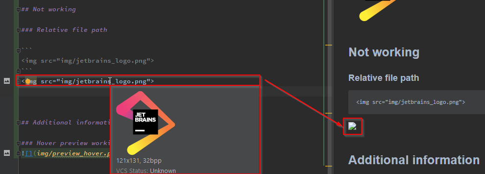

# jetbrains_markdown_image_support
Test suite to check the image support for the markdown preview by `` tag in mark down of jetbrains products.

# Contents
* Test environment
* Setup
* Working
  * Absolute external www
  * Absolute local file protocol
  * Absolute local file path
* Not working
  * Relative local file path
  * Additional information
    * Hover preview working, but not markdown preview

## Test environments
### Windows 10 - Intellij Ultimate
```
IntelliJ IDEA 2021.2 (Ultimate Edition)
Build #IU-212.4746.92, built on July 27, 2021
Licensed to IntelliJ IDEA Evaluator
Expiration date: September 4, 2021
Runtime version: 11.0.11+9-b1504.13 amd64
VM: OpenJDK 64-Bit Server VM by JetBrains s.r.o.
Windows 10 10.0
GC: G1 Young Generation, G1 Old Generation
Memory: 750M
Cores: 4

Kotlin: 212-1.5.10-release-IJ4746.92
```

## Setup

Copy the image file folder `img` of this project to `C:\Temp` so you have `C:\Temp\img` with the image files inside.

If you are running on macOS or Linux, search and replace `C:\Temp\img\` with on your own solution, e.g.: `/tmp/img/`

## Working

### Absolute external www

```

```


### Absolute internal file protocol
```

```


### Absolute internal file path
```

```


## Not working

### Relative file path

```

```


## Additional information

### Mouse hover preview is working, but not markdown preview
